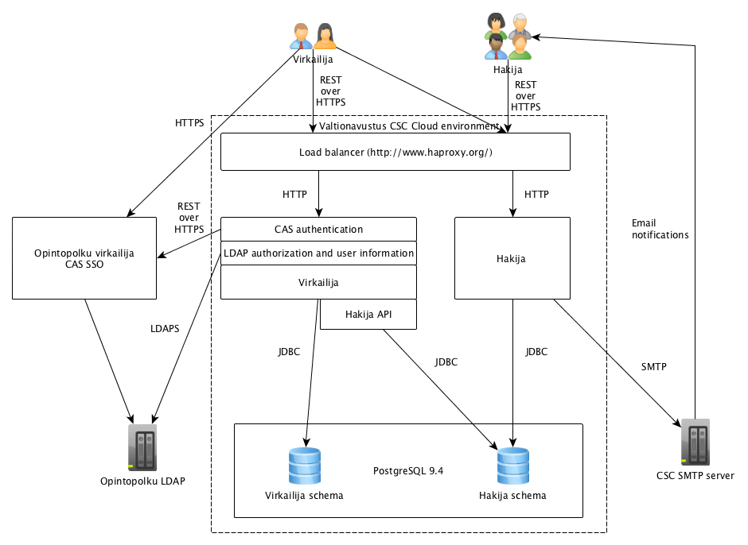
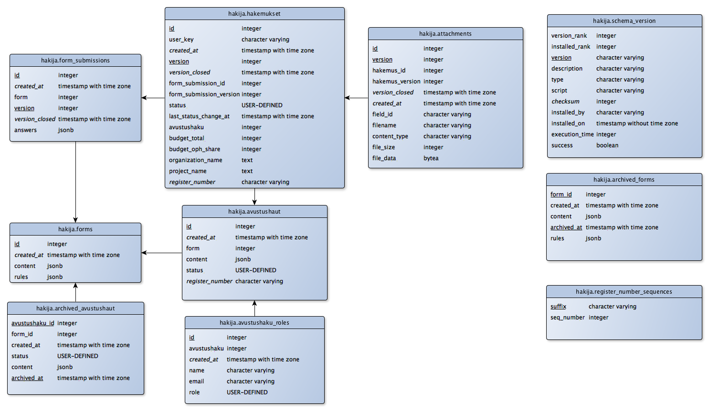
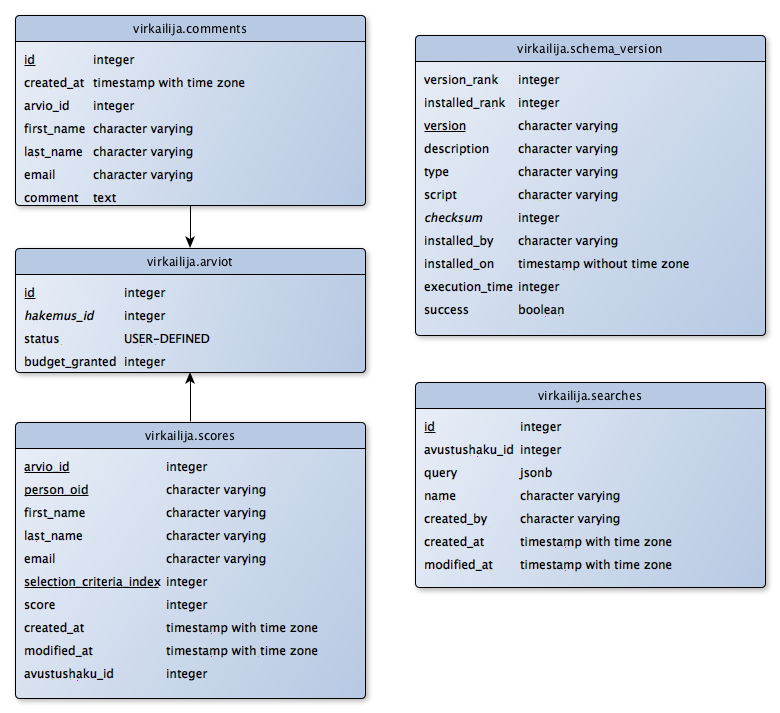

# Technical documentation

## Architecture

General architecture including integrations and data flows (from originator towards receiver) is described in picture below.

## API documentation

For Hakija app, the API documentation can be viewed via [Swagger](https://valtionavustukset.oph.fi/doc)

Virkailija app [Swagger](https://virkailija.valtionavustukset.oph.fi/doc) requires signing in with correct account.

## Database schemas

### hakija database

### virkailija database

