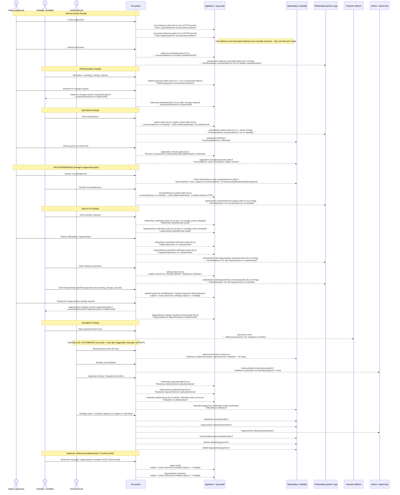

# Valtionavustus — email flows

```mermaid
sequenceDiagram
    actor Hakija as Hakija (applicant)
    actor Virkailija as Virkailija / Esittelijä
    actor Sched as Scheduled job
    participant VA as VA system
    participant App as Applicant + org email
    participant Pres as Valmistelija / esittelijä
    participant Partner as Yhteishanke partner orgs
    participant Pay as Payment officers
    participant Admin as Admin / report lists

    Note over Hakija,VA: APPLICATION PHASE

    Hakija->>VA: Create application
    VA-->>App: new-hakemus.plain.{fi,sv} (non-JOTPA grants)<br/>"Linkki organisaationne avustushakemukseen"
    VA-->>App: new-jotpa-hakemus.plain.{fi,sv} (JOTPA grants)<br/>"Linkki organisaationne avustushakemukseen"
    Note right of App: new-hakemus and new-jotpa-hakemus are mutually exclusive - only one fires per create

    Hakija->>VA: Submit application
    VA-->>App: hakemus-submitted.plain.{fi,sv}<br/>"...avustushakemus on kirjattu vastaanotetuksi"
    VA-->>Partner: yhteishanke-hakemus-submitted.plain.{fi,sv} (if flag)<br/>"...Yhteishankkeen avustushakemus %s on kirjattu vastaanotetuksi"

    Note over Virkailija,VA: PROCESSING PHASE

    Virkailija->>VA: Set status = pending_change_request
    VA-->>App: taydennyspyynto.plain.{fi,sv} (cc + bcc to presenting officer)<br/>"Täydennyspyyntö avustushakemukseesi"

    Hakija->>VA: Respond to change request
    VA-->>Virkailija: hakemus-change-request-responded.plain.fi<br/>"...avustushakemusta on täydennetty"
    VA-->>App: hakemus-submitted.plain.{fi,sv} (after-change-request)<br/>"...avustushakemusta on täydennetty"

    Note over Virkailija,VA: DECISION PHASE

    Virkailija->>VA: Send all decisions
    VA-->>App: paatos.plain.{fi,sv} / paatos-refuse.plain.{fi,sv}<br/>"...avustushakemus on käsitelty - Linkki päätösasiakirjaan" (no attachment)
    VA-->>Partner: yhteishanke-paatos.plain.{fi,sv} / -refuse (if flag)<br/>"...Yhteishankkeen avustushakemus %s on käsitelty..."
    VA-->>Pres: paatokset-lahetetty.fi<br/>"Avustuspäätökset on lähetetty"

    Hakija->>VA: Refuse grant via refuse link
    VA-->>App: application-refused.plain.{fi,sv}<br/>"Ilmoitus avustuksenne vastaanottamatta jättämisestä on lähetetty"
    VA-->>Pres: application-refused-presenter.plain.fi<br/>"Automaattinen viesti: Avustuksen saajan ilmoitus"

    Note over Hakija,VA: MUUTOSHAKEMUS (change to approved grant)

    Hakija->>VA: Submit muutoshakemus
    VA-->>Pres: notify-valmistelija-of-new-muutoshakemus.plain.fi<br/>"Automaattinen viesti: saapunut muutoshakemus" (if talousarvio/jatkoaika/sisältö/osapuoli)

    Virkailija->>VA: Decide muutoshakemus
    VA-->>App: muutoshakemus-paatos.plain.{fi,sv}<br/>"...muutoshakemus on käsitelty - Linkki päätösasiakirjaan" (+oikaisuvaatimus PDF)
    VA-->>Partner: yhteishanke-muutoshakemus-paatos.plain.{fi,sv} (if flag)<br/>"...Yhteishankkeen %s muutoshakemus on käsitelty"

    Note over Virkailija,VA: SELVITYS PHASE

    Virkailija->>VA: Send selvitys requests
    VA-->>App: valiselvitys-notification.plain.{fi,sv} (bcc to virkailija unless disabled)<br/>"Väliselvitys täytettävissä haulle"
    VA-->>App: loppuselvitys-notification.plain.{fi,sv} (bcc to virkailija unless disabled)<br/>"Loppuselvitys täytettävissä haulle"

    Hakija->>VA: Submit väliselvitys / loppuselvitys
    VA-->>App: valiselvitys-submitted-notification.plain.{fi,sv}<br/>"Väliselvityksenne on vastaanotettu"
    VA-->>App: loppuselvitys-submitted-notification.plain.{fi,sv}<br/>"Loppuselvityksenne on vastaanotettu"
    VA-->>Partner: yhteishanke-vali-/loppuselvitys-submitted.plain.{fi,sv} (if flag)<br/>"...Yhteishankkeen %s väli-/loppuselvitys on vastaanotettu"

    Virkailija->>VA: Mark selvitys processed
    VA-->>App: selvitys.plain.{fi,sv}<br/>subject entered by virkailija (default "Väliselvitys käsitelty")
    VA-->>Partner: yhteishanke-vali-/loppuselvitys-processed.plain.{fi,sv} (if flag)<br/>"...Yhteishankkeen %s väli-/loppuselvitys on käsitelty"

    Virkailija->>VA: Send loppuselvitys täydennyspyyntö (sets pending_change_request)
    VA-->>App: taydennyspyynto-asiatarkastus / taydennyspyynto-taloustarkastus<br/>subject + body entered by virkailija (reply-to = virkailija)

    Hakija->>VA: Respond to loppuselvitys change request
    VA-->>Virkailija: loppuselvitys-change-request-responded.plain.fi<br/>"...avustushakemuksen loppuselvitystä on täydennetty"
    VA-->>App: loppuselvitys-change-request-received.plain.{fi,sv}<br/>"Organisaationne loppuselvitystä on täydennetty:"

    Note over Virkailija,VA: PAYMENT PHASE

    Virkailija->>VA: Mark payment batch sent
    VA-->>Pay: payments-info.fi<br/>"...Valtionavustuserän '%s' maksatus suoritettu"

    Note over Sched,VA: SCHEDULED / AUTOMATED (cron jobs - most also triggerable manually via POST)

    Sched->>VA: MuistutusJob (every 60 min)
    VA-->>Pres: raportointivelvoite-muistutus.fi<br/>"Muistutus valtionavustuksen raportoinnista" (deadline < 30 days)

    Sched->>VA: Monthly reconciliation
    VA-->>Admin: kuukausittainen-tasmaytysraportti.fi<br/>"Edellisen kuukauden VA-täsmäytysraportti" (+xlsx)

    Sched->>VA: Applicant selvitys / hakuaika reminders
    VA-->>App: valiselvitys-palauttamatta.{fi,sv}<br/>"Muistutus väliselvityksen palauttamisesta"
    VA-->>App: loppuselvitys-palauttamatta.{fi,sv}<br/>"Muistutus loppuselvityksen palauttamisesta"
    VA-->>App: hakuaika-paattymassa.{fi,sv} (drafts, hakuaika ends tomorrow)<br/>"Hakuaika on päättymässä"
    VA-->>Pres: hakuaika-paattynyt.fi (hakuaika ended yesterday)<br/>"Hakuaika on päättynyt"

    Sched->>VA: Virkailija report / reminder digests (no subject in mail-titles)
    VA-->>Pres: valiselvitys-tarkastamatta.fi
    VA-->>Pres: loppuselvitys-asiatarkastamatta.fi
    VA-->>Admin: loppuselvitys-taloustarkastamatta.fi
    VA-->>Pres: muutoshakemuksia-kasittelematta.fi
    VA-->>Pres: laheta-valiselvityspyynnot.fi
    VA-->>Pres: laheta-loppuselvityspyynnot.fi

    Note over Virkailija,VA: MANUAL VIRKAILIJA MESSAGES TO APPLICANT

    Virkailija->>VA: Send free message / loppuselvitys reminder (POST /send-email)
    VA-->>App: vapaa-viesti<br/>subject + body entered by virkailija (reply-to = virkailija)
    VA-->>App: loppuselvitys-muistutus<br/>subject + body entered by virkailija (reply-to = virkailija)
```
